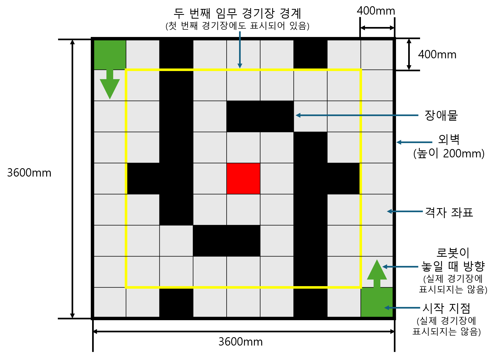
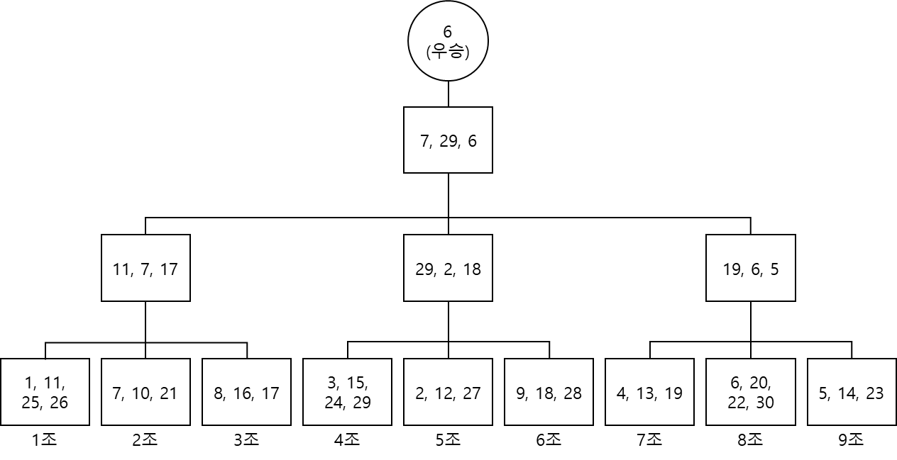
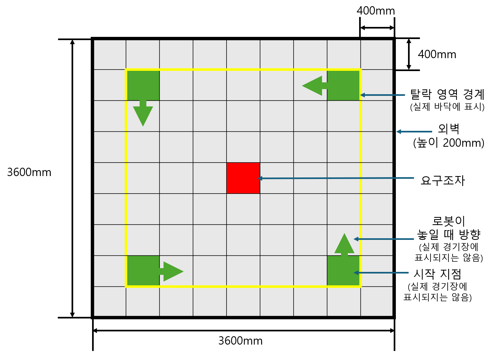

> 원본 HWP를 변환한 자료입니다. 본문은 요약하지 않고 문단 순서와 글자를 그대로 옮겼습니다.
> 원본에는 표가 없고 그림 3개가 있습니다. 그림은 `대회규정_그림/` 폴더에 저장했고,
> 그림 안의 글자는 각 그림 아래 "그림 속 글자"로 옮겨 적었습니다 (변환 시 추가).

# 2026(제29회) 창원대학교 전국대학생 자율로봇경진대회 규정(안)

## 1장. 대회방식에 대한 규정

1.1 본 대회는 “통신할 수 없고 기반시설이 부재한 환경”에서 자율적으로 임무 수행이 가능한 로봇을 제작하고 그 성능을 비교하는 것을 목표로 한다.

1.2 본 대회는 자율주행이 가능한 로봇을 활용해 정해진 임무를 수행하고, 그에 따른 성과를 비교하는 경기이다.

1.3. 로봇의 소프트웨어는 반드시 온보드 컴퓨팅 보드에서 모두 구동되어야 하며, 각 임무 시작 후 통신 모듈을 차단하여 외부 전자기기와 통신할 수 없다.

1.4 경기장은 대회 시작 직전에 공개된다.

1.5 경기장 공개 전, 참가 팀은 모든 임무에 대한 준비를 마치고 주최 측에서 준비한 wifi router 장비에 대회에 사용할 PC와 로봇을 연결한 후 제출하며, 경기장이 공개된 이후 참가자가 프로그램 수정 또는 버튼 조작 등 인위적인 조작은 할 수는 없다. (단, wifi 통신을 하는 경우에 한함.)

1.6 각 임무 수행 프로그램을 독립적으로 작성하는 것을 허용하며, 각 임무 시작 전 심판의 감독하에 제출한 PC를 돌려받아 무선 통신을 통해 로봇에 프로그램 실행 명령을 전달할 수 있다. 실행 명령 외 모든 소프트웨어는 on-board에서 이루어져야 한다.

1.7 대회 중 임무에 따른 로봇의 하드웨어 변경은 허용하지 않는다. 임무마다 부품을 탈착하는 것이 아닌 처음 제출된 로봇의 하드웨어로 모든 임무를 수행해야 한다.

1.8 이하는 대회 진행 과정을 나타낸다.

1.8.1 대회는 총 두 개의 독립적인 임무를 순차적으로 진행한다.

1.8.2 임무에 참가하는 모든 팀이 순차적으로 임무를 완료한 후 다음 임무를 진행한다.

1.8.3 성적에 따라 첫 번째, 두 번째 대회에서 중복해서 상을 받을 수 있다.

## 2장. 로봇에 관한 규정

2.1 이하는 로봇과 경기에 관한 전반적인 규정이다.

2.1.1 주최 측은 대회개최 전에 참가 로봇의 사진(전면 및 측면), 특징, 구조, 동작 설명을 포함하는 계획서를 요구할 수 있다.

2.1.2 대회 기간에 심사위원회는 참가 로봇의 소프트웨어 설명을 요구할 수 있다.

2.1.3 심사위원회는 운영위원회에서 정한다.

① 심사위원회는 2.1.1에 의해 제출된 자료를 외부로 유출할 수 없다.

② 규정 1장과 2.1.1 및 2.1.2를 근거로 심사위원회는 아래와 같은 판단으로 참가 로봇을 실격시킬 수 있다.

ⅰ) 로봇을 대여하여 대회에 참가한 경우

ⅱ) 로봇의 하드웨어/소프트웨어 구성에 관해 설명하지 못하는 경우

ⅲ) 경기 시작 후 허락된 순간 외에 외부 전자기기(PC, 조종기 등)와 통신한 경우

ⅳ) 대회 진행 중 사람에 의한 하드웨어/소프트웨어 수정이 적발된 경우

③ 심사위원이 경진대회의 규정에 반한다고 판단되는 경우는 규정 외로 제한한다.

2.1.4 심판진은 주심 1명, 부심 2명, 총 3명으로 한다.

2.2 이하는 로봇 외형에 관한 추가 제한규격이다.

2.2.1 로봇의 최대 무게는 10Kg 이내로 하며, 확장 가능한 부품 최대 확장 시 지름 400mm, 높이 300mm 원기둥에 들어갈 수 있는 크기여야 한다.

2.2.2 로봇은 자율주행을 해야 하며 동력원은 로봇에 탑재되어 있어야 한다. (외부동력 공급 및 외부조종기를 이용한 경우 실격처리 한다.)

2.2.3 로봇에 날카롭거나 뾰족한 형태를 가진 위험한 외부장치는 장착하여서는 안 된다.

2.2.4 경기 도중 로봇의 하드웨어의 추가·제거·교환·변경 등을 할 수 없다. 단, 경미한 파손으로 대회 진행에 어려움이 인정될 경우 기존 부품과 동일한 부품으로 심사위원회의 결정에 따라 허용할 수도 있다.

2.2.5 로봇의 수리와 배터리 교체는 각 미션 시작 전 가능하며, 미션 중에는 불가능하다.

2.2.6 로봇의 모든 부품은 항상 연결되어 있어야 하며, 의도적으로 일부 부품을 탈락시키거나 분리할 경우 실격시킬 수 있다.

## 3장. 경기 방식에 대한 규정

3.1 이하는 로봇 경기장에 대한 규격이다.

3.1.1 경기장은 3,600mm x 3,600mm의 정사각형 바닥 및 그 테두리에 200mm 높이의 벽이 세워진 공간이며, 내부에는 9x9 격자 구조로 구성되어 있으며 각 격자에는 장애물이 존재할 수도, 존재하지 않을 수도 있다.

3.1.2 경기장 내부는 회색조(grayscale, RGB=(127,127,127))로 구성되어 있으며, 관심대상과 구분이 가능한 색으로 구성되어있다. (단, 경기장 조명 및 사용되는 센서에 따라 RGB 값은 달라질 수 있으므로 참고용으로 활용)

3.1.3 장애물은 (wdh) 400mm x 400mm x 200mm 직육면체이며, 장애물 사이 공간은 400mm 배수(최소 1배)의 공간을 두고 띄워져 배치된다 장애물은 경기장 내부와 동일한 색상 (RGB=(127,127,127)) 및 패턴으로 구성되어있다.

3.1.4 장애물은 이동시킬 수 없게 고정되어 있으며, 장애물을 옮기거나 파손할 경우 실격처리 될 수 있다.

3.1.5 경기장은 경기 당일 모든 참가팀의 로봇과 PC를 주최측의 wifi router에 연결 후 수거한 다음 공개한다.

3.2 심판의 시작 신호에 따라 참가선수는 경기장의 지정된 위치에서 로봇을 구동시킨 후, 원격 PC를 logout하고 경기장으로부터 20cm 이상 안전 구역 밖으로 이탈한다.

3.3 다음은 첫 번째 임무(자율탐색 및 요구조자 구출)에 관한 규정이다.

3.3.1 첫 번째 임무는 2개의 팀이 한 조를 이루어 조별 우승팀을 선정하고, 이후 우승팀끼리 다음 경기를 진행하는 승자 진출 방식의 토너먼트 형식으로 진행된다.

3.3.2 경기는 장애물이 존재하는 경기장에서 진행되며, 장애물은 (5,5) 격자를 기준으로 점대칭을 이루도록 설계되어 있다. (구체적인 형상은 로봇 및 PC 수거 후 공개된다.)

3.3.3 경기 시간은 10분이며, 각 팀은 경기장의 지정된 위치 ((1,9), (9,1))에서 로봇을 구동시킨 후, 통신 연결을 끊는다.

3.3.4 각 팀의 로봇은 자율적으로 경기 영역을 탐색하며 정해진 “관심 대상”을 먼저 찾아 시작 지점으로 운송하면 승리한다.

3.3.5 관심 대상은 무광의 빨간색(RGB=(255,0,0)) 50mm x 50mm x 50mm 부피의 100g 내외의 정육면체이며 경기장 (5,5)에 위치한다. (참고, 센서나 조명에 따라 RGB는 다르게 인식될 수 있음)

3.3.6 관심 대상은 지면에 놓여있으며, 고정되어 있지 않다. 임무 수행 중 관심 대상의 위치를 이동시키는 것에 제한은 없고, 상대 로봇으로부터 탈취하는 것도 허용한다.

3.3.7 양 팀 모두 시간 내에 관심대상을 시작 위치로 운송시키지 못했을 경우, 시작 지점과 관심 대상까지의 상대 거리가 가까운 팀이 승리한다. 이때, 상대 거리는 심판이 판단하고, 이의가 있을경우 다음 경기가 진행되기 전 심사위원이 판단할 수 있다.

3.3.8 만약 양 팀 모두 제한 시간 내에 관심대상을 운송하지 못하고, 관심대상의 상대 위치가 동일할 경우 양 팀은 모두 탈락한다.

3.4 다음은 두 번째 임무(배틀럼블)에 관한 규정이다.

3.4.1 두 번째 임무는 4개의 팀이 한 조를 이루어 조별 우승팀을 선정하고, 이후 우승팀끼리 다음 경기를 진행하는 승자 진출 방식의 토너먼트 형식으로 진행된다. 각 조는 대회 당일 결정된다.

3.4.2 경기 시간은 5분이며, 4개의 팀이 한 조를 이루어 장애물이 제거된 경기장 각 격자 (2,2), (2,8), (8,2), (8,8) 위치에 로봇을 배치한다.

3.4.3 각 팀은 지정된 위치에서 로봇을 구동시킨 후, 통신 연결을 끊는다.

3.4.4 각 팀의 로봇은 경기장 중심에 배치된 빨간색 관심 대상(요구조자, RGB=(255,0,0))를 찾아 확보한다. 이때, 요구조자 확보 여부는 로봇을 지면에 수직하게 들어 올렸을 때 요구조자가 같이 들리는 경우 확보한 것으로 인정한다. (RGB는 참고용으로 활용)

3.4.5 각 팀의 로봇은 상대 로봇으로부터 요구조자를 탈환할 수 있다.

3.4.6 각 팀의 로봇은 상대 로봇을 밀어낼 수 있다. 이때 경기장의 각 모서리 격자(그림 3 예시 참고)까지 밀리거나 이동한 로봇은 즉시 탈락한다. 이때, 탈락한 로봇이 요구조자를 확보하고 있으면 요구조자는 즉시 원래 위치(경기장 중심)로 재배치되고 경기를 속행한다. 이때 원래 요구조자의 원래 위치에 로봇이 존재할 경우 심판에 의해 주변에 배치된다.

\* 로봇의 절반 이상 모서리 격자로 밀려난 경우 심판의 판정에 따라 탈락 여부가 결정된다.

3.4.7 다음은 각 조의 우승팀 선정 규정이다.

3.4.7.1 경기 제한 시간이 끝난 시점에서 요구조자를 확보한 로봇의 팀

3.4.7.2 경기 제한 시간이 끝난 시점에서 2개 이상의 로봇이 동시에 요구조자 확보 시 (즉, 2개 이상의 로봇이 요구조자를 중심으로 강하게 결합 되어있고, 해당 로봇들을 동시에 수직으로 들었을 때 요구조자가 같이 들리는 경우), 해당 팀들의 로봇으로 3분의 재경기를 진행한 뒤 우승팀을 결정한다.

3.4.7.3 만약 재경기에서도 제한 시간이 끝난 시점에서 다수의 팀이 요구조자를 확보하고 있으면, 해당하는 팀 중 더 먼저 요구조자를 확보한 팀을 우승으로 선정한다. (단, 확보 후 놓쳤다가 다시 확보한 경우는 다시 확보한 시점을 기준으로 계산한다. 즉, 경기 종료 시점으로부터 연속적으로 가장 오랫동안 요구조자를 확보한 팀을 우승으로 선정한다.)

3.4.8 본 임무의 순위는 조별 우승팀을 기준으로 하되, 그 외 같은 조 내 등수에 대해서는 로봇의 전체 무게(배터리 포함)로 평가한다.

예시) 그림 2에서 1등은 결승 승리 팀인 6팀, 각 2등과 3등은 7팀과 29팀 중 로봇의 무게가 적게 나가는 팀이 2등, 다른 한 팀이 3등이다. 이후 마찬가지로 4~9등은 11, 17, 2, 18, 5, 19팀 중 무게가 적게 나가는 순서로 결정된다. 이후의 등수가 필요할 경우 해당 규정을 반복한다.

3.5 이하의 경우 심사위원회는 로봇을 실격시킬 수 있다.

3.5.1 위 2.1, 2.2의 조건에 적합하지 않은 경우

3.5.2 심판의 경기 종료 선언 이전에 참가자가 경기장 근처 20cm 내로 들어올 경우

3.5.3 대회 중 임무 프로그램 실행 순간을 제외하고 외부 전자기기와 통신하는 경우

3.5.4 대회 중 하드웨어 및 소프트웨어(코드 파일, 매개변수 파일 등)를 참가자가 직접 수정하는 경우

3.5.5 로봇이 경기장 및 관심 대상을 훼손하는 경우 (파괴, 손상 등 경기 속행이 불가능할 정도의 훼손)

3.5.6 심판의 시작 선언 전에 로봇이 기동하는 경우

3.5.7 참가팀이 비신사적인 행위를 할 경우

3.6 본 대회에서는 의도적인 무기 사용을 제한하며 이하의 무기를 사용하는 경우 심사위원회는 로봇을 실격시킬 수 있다.

3.6.1 로봇 스스로 다시 회수 후 재장착이 불가능한 발사형 무기인 경우

3.6.2 액체나 불과 같은 무기인 경우

3.6.3 경기장을 훼손시킬 가능성이 있는 경우

3.6.4 상대방 로봇의 회로를 의도적으로 파괴 또는 손상 시키려는 목적으로 전기충격이나  전자파를 발생시킬 수 있는 구성품(부품)이 있거나 장착되어 있는 경우

3.6.5 상대방 로봇의 센서 동작을 방해할 수 있는 구성품(부품)이 있거나 장착되어 있는 경우

3.6.6 날카롭거나 뾰족한 형태의 무기인 경우

## 4장 전체 운영규정에 대한 예외규정

4.1 규정에 명시되지 않은 사항들은 심사위원회의 결정에 따른다.

4.1.1 모든 참가자가 규정을 숙지할 수 있도록 조취를 취하고 대회당일 대회장에 규정 보드를 설치한다.

4.1.2 위 4.1.1의 규정을 실시하였으나 참가자가 규정을 숙지 못하였을 경우 심사위원회는   책임을 지지 않는다.

4.2 경기나 대회장 주변의 상황이 규정에 어긋난다고 판단될 때, 심사위원회의 결정에 따라   규정을 수정 적용할 수 있다.

4.3 경기방식은 대회당일 참가팀 수에 따라 당초 규정대로 진행이 어려울 경우 참가팀의 동의를 얻어 심사위원회에서 변경할 수도 있다.

4.4 참가자는 위 4장의 규정에 이의를 제기할 수 없으며 필요 이상의 대회가 지연될 정도의   행동은 퇴장조치 한다.

\<그림 1\> 첫 번째 경기장 예시 (바닥, 벽, 장애물) 단위:mm

그림 속 글자 (변환 시 옮겨 적음):
- 두 번째 임무 경기장 경계 (첫 번째 경기장에도 표시되어 있음) — 노란 선
- 장애물 — 검은 칸
- 외벽 (높이 200mm)
- 격자 좌표
- 로봇이 놓일 때 방향 (실제 경기장에 표시되지는 않음) — 초록 화살표
- 시작 지점 (실제 경기장에 표시되지는 않음) — 초록 칸 (왼쪽 위, 오른쪽 아래)
- 400mm (격자 한 칸 가로·세로)
- 3600mm (경기장 가로·세로)
- 빨간 칸 — 중앙 격자의 관심 대상

\<그림 2\> 세 번째 경기 대진표 예시

첫 경기의 조 개수가 달라질 수 있음 
그 경우 승리 조의 대진은 심사위원회에 의해 결정됨 
(예, 3개 팀 10개 조 또는 4개 팀 6개 조와 3개 팀 2개 조)

그림 속 글자 (변환 시 옮겨 적음):
- 1조: 1, 11, 25, 26 / 2조: 7, 10, 21 / 3조: 8, 16, 17 / 4조: 3, 15, 24, 29 / 5조: 2, 12, 27 / 6조: 9, 18, 28 / 7조: 4, 13, 19 / 8조: 6, 20, 22, 30 / 9조: 5, 14, 23
- 2단계: (1~3조 승자) 11, 7, 17 / (4~6조 승자) 29, 2, 18 / (7~9조 승자) 19, 6, 5
- 결승: 7, 29, 6
- 우승: 6 (우승)

\<그림 3\> 두 번째 경기장 예시(바닥, 벽, 장애물) 단위:mm

그림 속 글자 (변환 시 옮겨 적음):
- 탈락 영역 경계 (실제 바닥에 표시) — 노란 선 (가장 바깥 한 줄 격자가 탈락 영역)
- 외벽 (높이 200mm)
- 요구조자 — 중앙 빨간 칸
- 로봇이 놓일 때 방향 (실제 경기장에 표시되지는 않음) — 초록 화살표
- 시작 지점 (실제 경기장에 표시되지는 않음) — 초록 칸 4곳
- 400mm (격자 한 칸 가로·세로)
- 3600mm (경기장 가로·세로)
