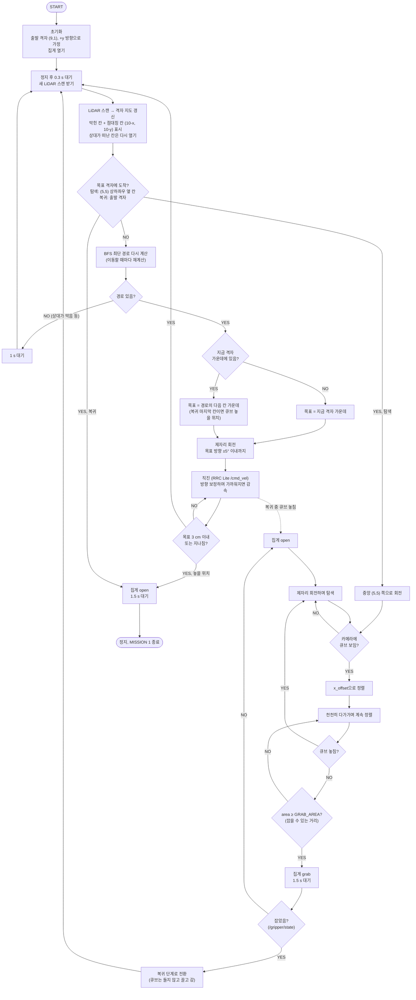

# 임무 1 순서도 (현재 하드웨어·코드 기준)

`ros2_ws/src/poli_navigation/poli_navigation/mission1_logic.py`의 동작을 그대로 그린 것이다.
코드를 바꾸면 이 그림도 같이 고친다.

## 원래 순서도와 달라진 점

| 원래 | 바뀐 것 | 이유 |
|---|---|---|
| 목표 (5,5) | (5,5)의 상하좌우 옆 칸, 거기서 카메라로 접근 | (5,5)에는 큐브가 있어서 들어가면 큐브를 밀어낸다 |
| RoboClaw 제어 | RRC Lite (`/cmd_vel`) | 하드웨어 변경 |
| 엔코더로 400 mm 확인 | odom 추정 위치가 목표 3 cm 이내 | RRC Lite 공장 펌웨어는 엔코더 값을 Pi로 보내지 않는다. odom은 보낸 속도 명령 기반 추정이다 |
| Arducam | Raspberry Pi AI Camera (`/vision/target`) | 하드웨어 변경 |
| TCS34725 근접 재확인 | 없음. 카메라 `area`로 거리 판단 후 `/gripper/state`로 잡았는지 확인 | RGB 컬러 센서는 쓰지 않기로 함 (2026-10-06) |
| 회전 0° / ±90° / 180° | 목표 칸 방향으로 회전 (±5°) | 격자 가운데에서 벗어나 있으면 먼저 가운데로 돌아간다 |
| 실패 경로 없음 | 길 막힘 대기, 잡기 실패·복귀 중 놓침 시 다시 탐색 | 상대 로봇이 있는 토너먼트 |
| — | 점대칭 칸 같이 표시 | 규정상 장애물은 (5,5) 기준 점대칭 |
| START 도착 | 큐브가 출발 칸 가운데에 오는 위치에서 집게 열기 | 로봇 중심이 아니라 큐브를 칸 안에 넣는다 |

## 아직 정하지 않은 것
- 중앙에 큐브가 없을 때 (상대가 먼저 가져감) 대응: 지금은 제자리 회전 탐색만 한다.
- 집게 상태를 모르면 잡은 것으로 본다.
- 엔코더가 없어서 위치 오차가 쌓인다. IMU(`/odometry/filtered`)와 LiDAR 외벽 거리 보정으로 줄이는 것이 남은 과제다.
