> 원본 HWP를 변환한 자료입니다. 본문·표·제품명·모델명·수치·단위·주석을 요약하지 않고 원문 순서대로 옮겼습니다.
> 병합 셀이나 표 안의 표가 있는 표는 칸 구조를 보존하려고 HTML 표로 넣었습니다.
> 그림은 `제품_사양서_E_그림/`에 PNG로 추출해 원래 위치에 연결했습니다. 그림 안의 글자는 텍스트로 옮기지 않았습니다 (그림으로 보존, 내용 추측 안 함).
> 원문 하이퍼링크 2개는 HWP 변환기가 글자를 빠뜨려서 원본에서 직접 읽어 넣었습니다.

<table>
<tr><td>제품명</td><td colspan="2">라즈베리파이 AI 카메라 (Raspberry Pi AI Camera)</td></tr>
<tr><td colspan="2">제품 사진</td><td>제품 사양</td></tr>
<tr><td colspan="2">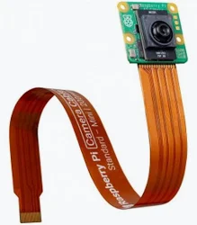</td><td><table>
<tr><td>항목</td><td>내용</td></tr>
<tr><td>센서</td><td>Sony IMX500</td></tr>
<tr><td>해상도</td><td>12.3 메가픽셀</td></tr>
<tr><td>센서 크기</td><td>7.857 mm (1/2.3형)</td></tr>
<tr><td>픽셀 크기</td><td>1.55 µm × 1.55 µm</td></tr>
<tr><td>수평/수직 해상도</td><td>4056 × 3040 픽셀</td></tr>
<tr><td>IR 컷 필터</td><td>내장 (적외선 차단 필터 포함)</td></tr>
<tr><td>오토포커스 시스템</td><td>수동 초점 조정 (Manual adjustable focus)</td></tr>
<tr><td>초점 거리</td><td>20cm ~ 무한대</td></tr>
<tr><td>초점 거리</td><td>4.74 mm</td></tr>
<tr><td>수평 시야각</td><td>66.3° ±3°</td></tr>
<tr><td>수직 시야각</td><td>52.3° ±3°</td></tr>
<tr><td>조리개 비율</td><td>F1.79</td></tr>
<tr><td>적외선 감지</td><td>감지하지 않음 (No)</td></tr>
<tr><td>출력</td><td>Bayer RAW10 이미지,ISP 출력(YUV/RGB), ROI(영역선택), 메타데이터 출력 지원</td></tr>
<tr><td>입력 텐서 최대 크기</td><td>640 × 640 (H × V)</td></tr>
<tr><td>입력 데이터 타입</td><td>int8 또는uint8</td></tr>
<tr><td>내부 메모리</td><td>약 8</td></tr>
</table></td></tr>
<tr><td colspan="3">기타 상세 정보</td></tr>
<tr><td colspan="3">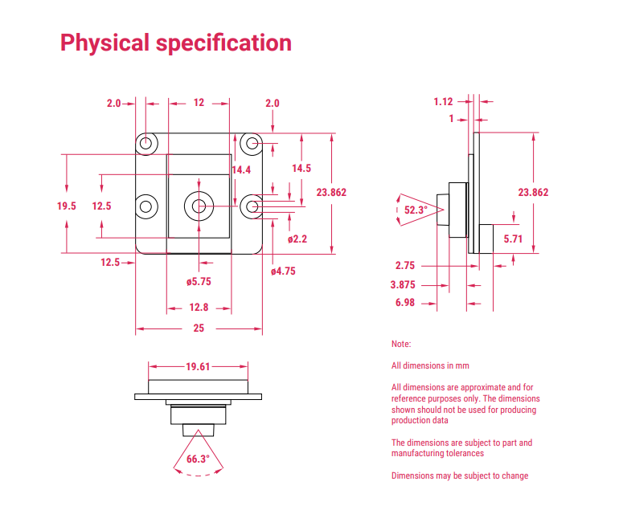 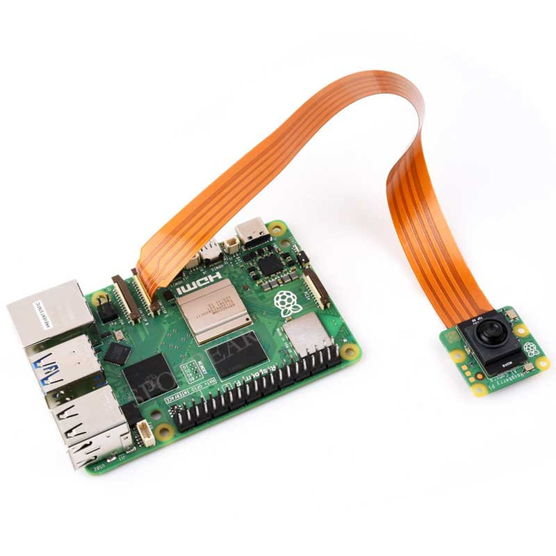 빨간 부분 카메라 포트 좌: CAM1, 우: CAM 2 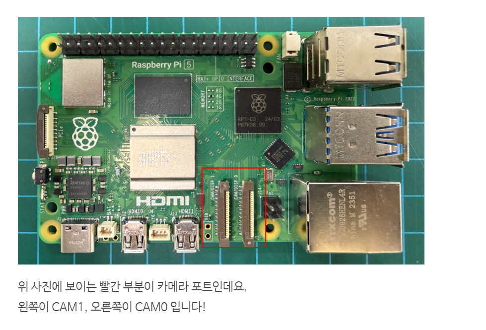 라즈베리파이 카메라 모듈은 리본 형태로 제작되어 있어 라즈베리파이 CAM0 부분에 체결 CAM0은 메인 카메라 입력용 기본 포트로 설정되어 있습니다. CAM1은 듀얼 카메라 사용 시 보조 입력용입니다. 참고 자료 : <a href="https://blog.naver.com/no1_devicemart/223305384819">라즈베리파이 카메라 모듈 기본 사용법📸 : 네이버 블로그</a> 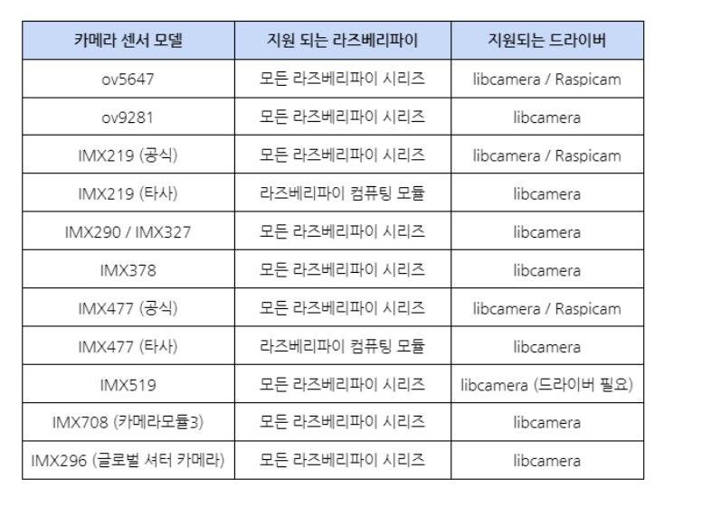</td></tr>
</table>

<table>
<tr><td>제품명</td><td colspan="2">RPLIDAR C1</td></tr>
<tr><td colspan="2">제품 사진</td><td>제품 사양</td></tr>
<tr><td colspan="2">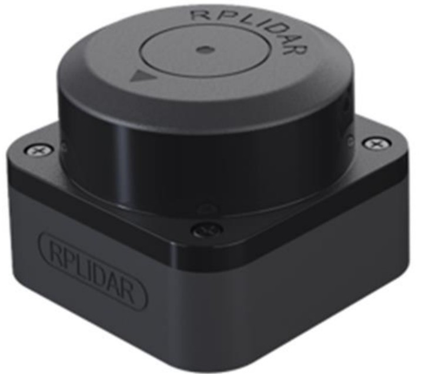</td><td><table>
<tr><td>스캔 범위</td><td>360°</td></tr>
<tr><td>샘플링 속도</td><td>5,000개 샘플/초</td></tr>
<tr><td>거리 범위</td><td>반사율 70%에서 0.05~12m, 반사율 10%에서 0.05~6m</td></tr>
<tr><td>전원 공급 장치</td><td>4.8~5.2V DC; 일반적인 값은 5V</td></tr>
<tr><td>작동 전류</td><td>5V, 10Hz에서 일반적인 전류는 230mA,   최대 전류는 260mA</td></tr>
<tr><td>스캔 속도</td><td>일반적으로 10Hz, 8-12Hz</td></tr>
<tr><td>작동 온도</td><td>-10 ~ +40 °C; 0 °C 이상에서 시동</td></tr>
<tr><td>무게</td><td>110g</td></tr>
<tr><td>플랫폼</td><td>라즈베리파이</td></tr>
</table></td></tr>
<tr><td colspan="3">기타 상세 정보</td></tr>
<tr><td colspan="3">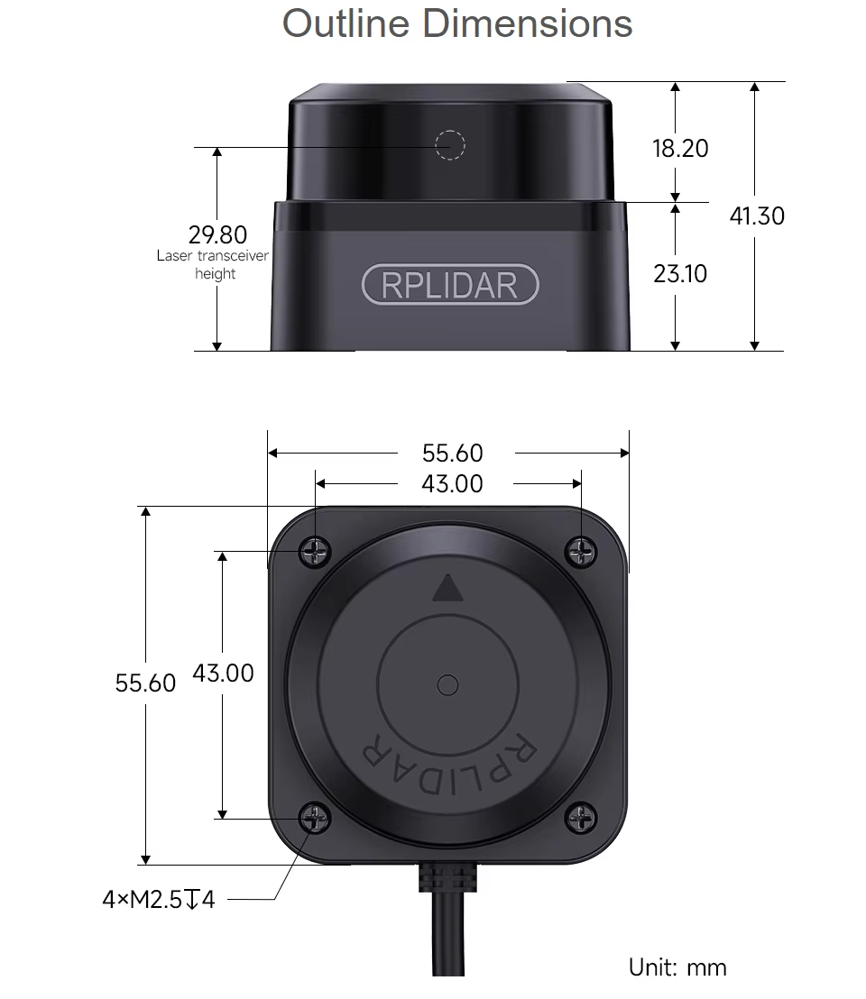  RPLIDAR 본체를 USB 어댑터보드에 연결 어댑터 보드의 USB 케이블을 라즈베리파이에 꽂기 USB 어댑터를 통하여 라이다 센서 사용 -&gt; 구체적인 내용 참고 <a href="https://blog.naver.com/no1_devicemart/223273535991">[SLAMTEC] RPLIDAR 슬램텍 라이다.. : 네이버블로그</a> 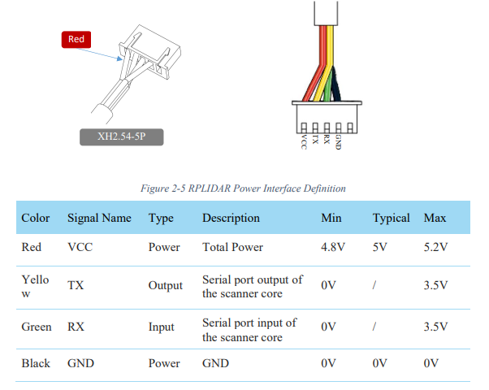</td></tr>
</table>

<table>
<tr><td>제품명</td><td colspan="3">JGB37-520 인코더 12V 330RPM DC 모터</td></tr>
<tr><td colspan="2">제품 사진</td><td colspan="2">제품 사양</td></tr>
<tr><td colspan="2">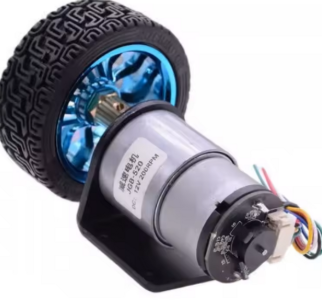</td><td colspan="2">감속비: 1:30 【확인】 정격 전압: DC 12V 속도: 250RPM (무부하 시 330RPM) 정격 전류: 1A (무부하 시 120mA) 스톨(정지) 전류: 2.3A 정격 토크: 3.5 kg·cm (최대 토크: 5 kg·cm) 출력축: Ø6mm D컷 【확인】 엔코더: 홀 센서 2채널(A/B상) 증분형 엔코더 분해능: 11PPR × 1:30 = 330PPR (4체배 시 1320 CPR) 엔코더 전압: 3~5V (본 로봇은 5V 사용) 엔코더 커넥터: PH2.0mm 6핀 무게: 150g (모터 단품 기준) 【확인】 길이: 58mm (기어박스 포함, 엔코더 포함 여부 【확인】) 최대 직경: 37mm</td></tr>
<tr><td colspan="4">기타 상세 정보</td></tr>
<tr><td colspan="3">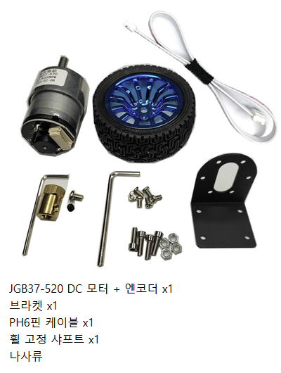</td><td>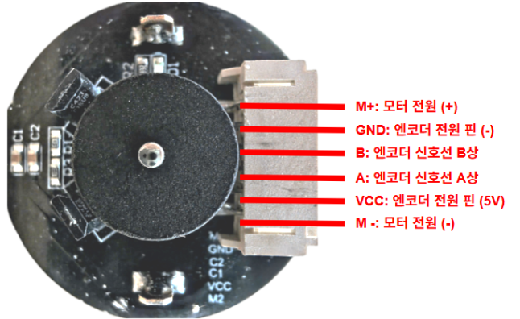</td></tr>
<tr><td colspan="4">바퀴: 고무 바퀴 Ø65 × 26mm (모터 키트 포함) 바퀴 1회전 이동거리: 약 204.2mm 엔코더 1count당 이동거리: 약 0.155mm (1320 CPR 기준) 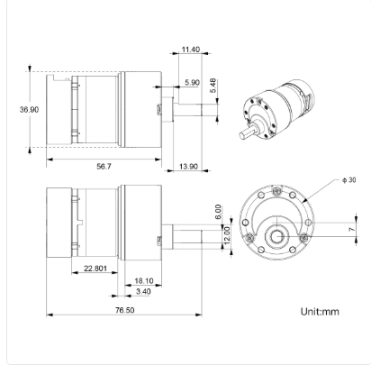 5번핀 (VCC) : 아두이노 메가 5V 2번핀 (GND) : 아두이노 메가 GND (모터 드라이버 GND와 공통 연결 필수) 4번핀 (A)   : 왼쪽 모터 → D2  / 오른쪽 모터 → D18 (외부 인터럽트 핀) 3번핀 (B)   : 왼쪽 모터 → D3  / 오른쪽 모터 → D19 (외부 인터럽트 핀) 1번·6번핀   : 모터 드라이버 출력단 (아두이노 직접 연결 금지) 정격 동작점 : 12V, 250RPM, 1A, 3.5 kg·cm → 연속 주행 시 이 부근에서 운용 무부하 : 330RPM, 120mA → 부하가 커질수록 속도는 낮아지고 전류는 증가 스톨(정지) : 2.3A, 최대 토크 5 kg·cm → 상대 로봇과 밀어내기 시 순간 도달 가능 → 모터 드라이버는 채널당 2.3A 이상의 순간 전류를 견뎌야 함</td></tr>
</table>

<table>
<tr><td>제품명</td><td colspan="2">Byte Robot Black Composite Claw 125mm / Claw 4</td></tr>
<tr><td colspan="2">제품 사진</td><td>제품 사양</td></tr>
<tr><td colspan="2">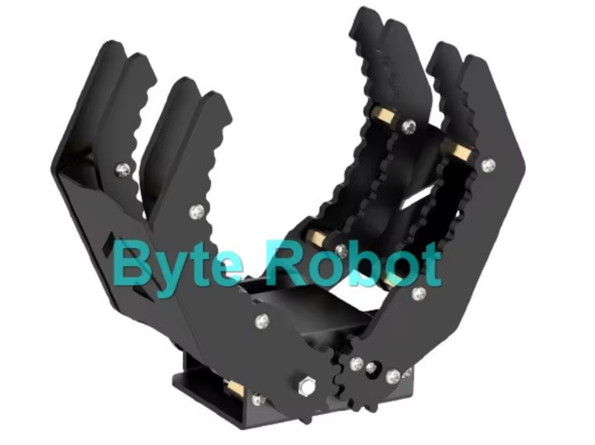</td><td>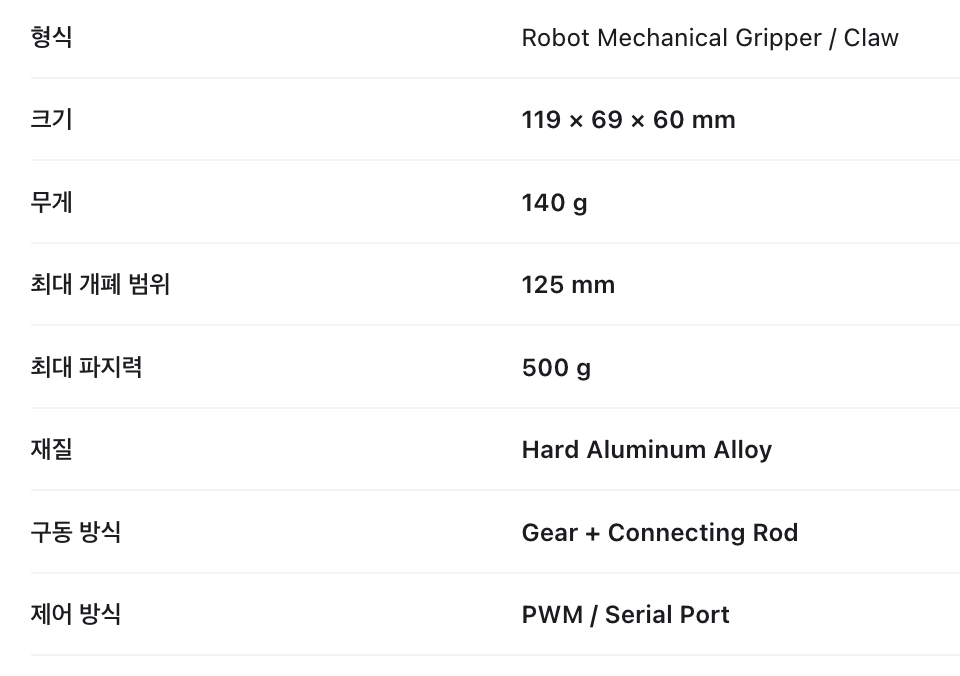</td></tr>
<tr><td colspan="3">기타 상세 정보</td></tr>
<tr><td colspan="3">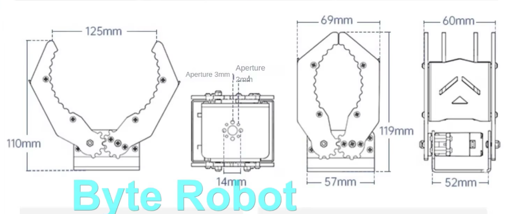</td></tr>
</table>

<table>
<tr><td>제품명</td><td colspan="2">DS3218</td></tr>
<tr><td colspan="2">제품 사진</td><td>제품 사양</td></tr>
<tr><td colspan="2">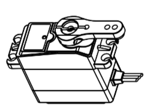</td><td>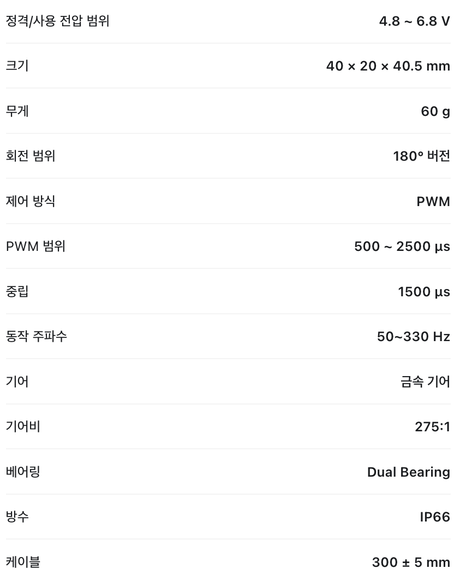</td></tr>
<tr><td colspan="3">기타 상세 정보</td></tr>
<tr><td colspan="3">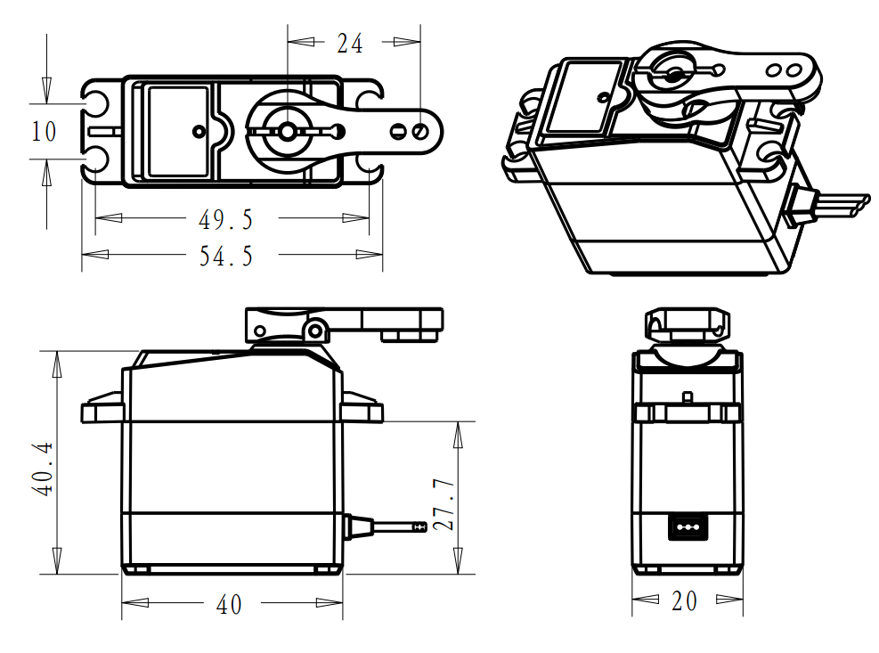 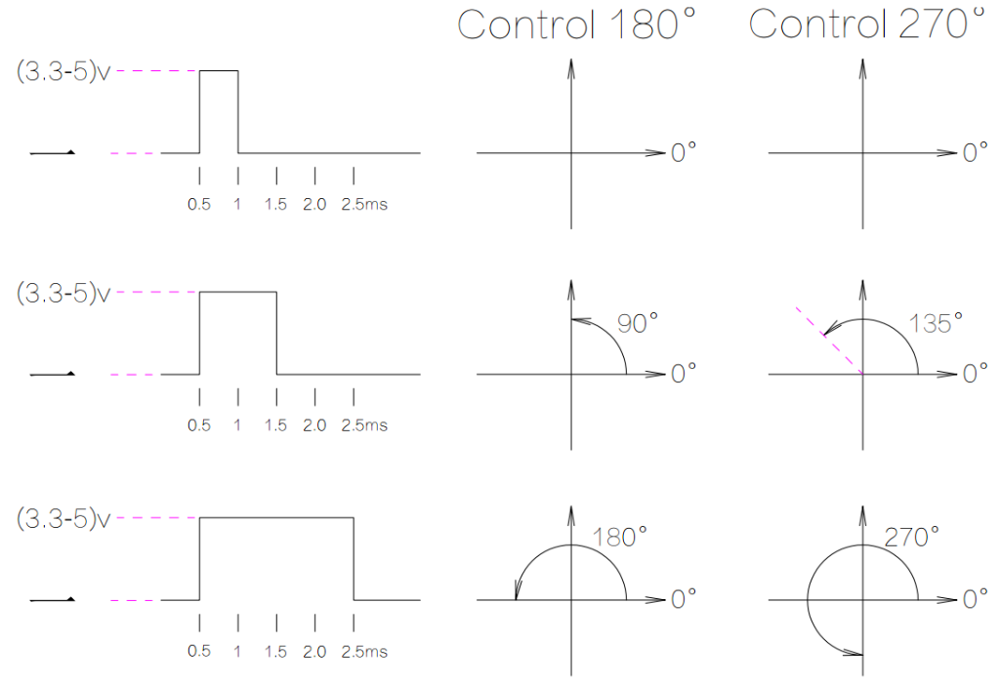</td></tr>
</table>

<table>
<tr><td>제품명</td><td colspan="2">RRC Lite Controller</td></tr>
<tr><td colspan="2">제품 사진</td><td>제품 사양</td></tr>
<tr><td colspan="2">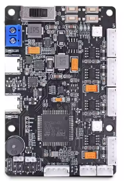</td><td>메인 제어 칩: STM32F407VET6(100핀) IMU 센서: 3축 가속도, 3축 중력 가속도 직렬 서보 인터페이스: 2채널 (6-12V) USB 시리얼 포트: 1× USB 타입-C 응답 구성 요소: 부저 1개, LED 3개, RGB 조명 2개 다운로드 인터페이스: 원클릭 직렬 다운로드 보드 레이어: 산업용 2층 PCB 장착 구멍 간격: 57.5×48.5mm 모터 드라이버 칩: SA8870C(과전류 보호 기능 포함) 엔코더 모터 인터페이스: 4채널(독립 드라이브) PWM 서보 인터페이스: 4채널(5-12V) IIC 인터페이스: 1× 4핀 인터페이스 전원 입력: 6-14V 넓은 전압 입력 외부 전원 출력: 5V 5A 보호 회로: 과열, 단락, 과전류 보호 크기: 85×56×17mm 무게: 329g</td></tr>
<tr><td colspan="3">기타 상세 정보</td></tr>
<tr><td colspan="3">[본 로봇에서의 역할] 라즈베리파이(상위 제어)에서 목표 속도 명령을 받아 좌우 모터를 구동하고, 엔코더 신호로 실제 속도를 측정해 속도 제어(PID)를 수행하는 하위 제어기. [연결 계획] 전원 입력 : 모터용 DC-DC 컨버터(Daygreen, 12V 출력) → RRC Lite 전원 입력 ※ 6S 배터리(최대 25.2V) 직접 연결 금지 – 입력 허용 14V 초과로 보드 파손 모터 포트 M1 : 왼쪽 JGB37-520 (PH2.0 6핀) 모터 포트 M2 : 오른쪽 JGB37-520 (PH2.0 6핀) 5V 5A 출력 : 라즈베리파이 5 전원 공급 USB : 라즈베리파이와 시리얼 통신 (속도 명령 / 엔코더·IMU 데이터 전달) [데이터 흐름] 라즈베리파이 → RRC Lite : 좌우 바퀴 목표 속도 엔코더 → RRC Lite      : 실제 회전 속도·회전량 RRC Lite → 모터         : PWM으로 출력 조절 RRC Lite → 라즈베리파이 : 엔코더 값, IMU 값 (오도메트리 계산용) □ 제품 사양 (Hiwonder RRC Lite Controller) <table>
<tr><td>항목</td><td>내용</td></tr>
<tr><td>구동 가능한 모터 수</td><td>4개 (본 로봇은 2개 사용)</td></tr>
<tr><td>보드 내 보조 프로세서</td><td>STM32F407VET6 (Cortex-M4, 168MHz)</td></tr>
<tr><td>모터 구동 칩</td><td>SA8870C (과전류 보호 내장)</td></tr>
<tr><td>모터 엔코더</td><td>AB상 엔코더 입력 4채널 (엔코더 모터 포트 일체형)</td></tr>
<tr><td>통신 방식</td><td>USB 시리얼 (라즈베리파이와 연결)</td></tr>
<tr><td>입력 전압</td><td>DC 6~14V (본 로봇은 12V 컨버터 출력 사용)</td></tr>
<tr><td>외부 전원 출력</td><td>5V 5A (라즈베리파이 5 전원 규격 지원)</td></tr>
<tr><td>서보 포트</td><td>PWM 서보 4채널 (5~8.4V), 시리얼 버스 서보 2채널 (6~12V)</td></tr>
<tr><td>내장 센서</td><td>6축 IMU (가속도 3축 + 자이로 3축)</td></tr>
<tr><td>기타</td><td>I²C 확장 포트, 부저 1개, LED 3개, RGB LED 2개</td></tr>
<tr><td>크기 / 무게</td><td>85 × 56 × 17 mm / 32g</td></tr>
<tr><td>제어 방식</td><td>라즈베리파이가 USB 시리얼로 목표 속도를 보내면, 보드가 엔코더를 읽어 속도 제어(PID)를 수행함</td></tr>
</table> □ 통신 프로토콜 (기능 목록) <table>
<tr><td>기능</td><td>방향</td><td>내용</td><td>본 로봇 사용</td><td>패킷 규격</td></tr>
<tr><td>모터 속도 제어</td><td>Pi → 보드</td><td>모터별 목표 속도 지정, 보드가 엔코더 기반 PID로 유지</td><td>○ 주행</td><td>SDK 확인 후 기입</td></tr>
<tr><td>모터 PWM(듀티) 제어</td><td>Pi → 보드</td><td>PID 없이 출력 비율 직접 지정</td><td>△ 시험용</td><td>SDK 확인 후 기입</td></tr>
<tr><td>PWM 서보 제어</td><td>Pi → 보드</td><td>펄스폭 500~2500µs (0~180°)</td><td>○ 그리퍼</td><td>SDK 확인 후 기입</td></tr>
<tr><td>IMU 데이터</td><td>보드 → Pi</td><td>가속도·각속도</td><td>△ 백업·충돌 감지</td><td>SDK 확인 후 기입</td></tr>
<tr><td>배터리 전압</td><td>보드 → Pi</td><td>전압 측정값 (mV)</td><td>○ 저전압 감시</td><td>SDK 확인 후 기입</td></tr>
<tr><td>부저 / LED</td><td>Pi → 보드</td><td>상태 알림</td><td>△ 디버깅</td><td>SDK 확인 후 기입</td></tr>
</table></td></tr>
</table>

<table>
<tr><td>제품명</td><td colspan="4">HC-SR04</td></tr>
<tr><td colspan="2">제품 사진</td><td colspan="3">제품 사양</td></tr>
<tr><td colspan="2"></td><td colspan="3"><table>
<tr><td>동작 전압</td><td>DC 5V</td></tr>
<tr><td>동작 전류</td><td>15mA</td></tr>
<tr><td>동작 주파수</td><td>40Hz</td></tr>
<tr><td>최대 감지 거리</td><td>4m</td></tr>
<tr><td>최소 감지 거리</td><td>2cm</td></tr>
<tr><td>감지 각도</td><td>15도</td></tr>
<tr><td>트리거 입력 신호</td><td>10마이크로초(μs) TTL 펄스</td></tr>
<tr><td>에코 출력 신호</td><td>TTL 레벨 신호, 거리 비례 출력</td></tr>
<tr><td>크기</td><td>45 × 20 × 15mm</td></tr>
</table></td></tr>
<tr><td colspan="5">기타 상세 정보</td></tr>
<tr><td colspan="3"></td><td colspan="2"><table>
<tr><td>센서 핀명</td><td>Arduino 핀명</td><td>설명</td></tr>
<tr><td>VCC (빨간색 선)</td><td>5V</td><td>센서 구동 전원 (DC 5V 입력)</td></tr>
<tr><td>Trig (초록색 선)</td><td>D13</td><td>초음파 신호 발사를 위한 트리거 입력 (10μs 펄스)</td></tr>
<tr><td>Echo (파란색 선)</td><td>D12</td><td>반사된 초음파 신호 수신 (펄스 폭을 통해 거리 계산)</td></tr>
<tr><td>GND (검은색 선)</td><td>GND</td><td>전원 음극, 공통 접지</td></tr>
</table></td></tr>
<tr><td colspan="5">아두이노 코드 예시</td></tr>
<tr><td rowspan="2" colspan="4">int trigPin = 6;   // 초음파 발사 핀 int echoPin = 7;   // 반사 신호 수신 핀 void setup() { Serial.begin(9600);       // 시리얼 통신 속도 설정 (9600bps) pinMode(echoPin, INPUT);  // Echo 핀을 입력으로 설정 pinMode(trigPin, OUTPUT); // Trig 핀을 출력으로 설정 } void loop() { long duration;   // 초음파가 되돌아오는 시간(μs) float distance;  // 계산된 거리(mm) // 초음파 발사 신호 보내기 digitalWrite(trigPin, HIGH); delayMicroseconds(10);   // 10μs 동안 HIGH 유지 → 초음파 발사 digitalWrite(trigPin, LOW); // 반사파가 돌아올 때까지 HIGH 상태 지속 시간 측정 duration = pulseIn(echoPin, HIGH); // 거리 계산식 (음속 340m/s, 왕복거리이므로 2로 나눔) distance = (float)(340 * duration / 1000) / 2;  // 단위: mm // 시리얼 모니터에 출력 Serial.print(&quot;Distance: &quot;); Serial.print(distance); Serial.println(&quot; mm\n&quot;); delay(100); // 0.1초마다 반복 측정 }</td><td>출력 형태</td></tr>
<tr><td>Distance: 123.4 mm Distance: 122.8 mm Distance: 124.0 mm Distance: 245.6 mm</td></tr>
</table>

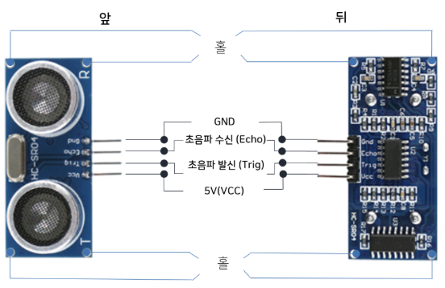

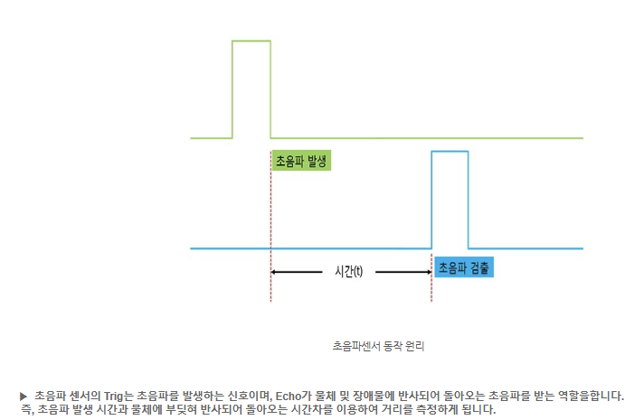

<table>
<tr><td>제품명</td><td colspan="2"></td></tr>
<tr><td colspan="2">제품 사진</td><td>제품 사양</td></tr>
<tr><td colspan="2"></td><td></td></tr>
<tr><td colspan="3">기타 상세 정보</td></tr>
<tr><td colspan="3"></td></tr>
</table>

<table>
<tr><td>제품명</td><td colspan="2">라즈베리파이5</td></tr>
<tr><td colspan="2">제품 사진</td><td>제품 사양</td></tr>
<tr><td colspan="2">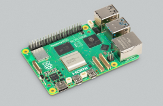</td><td>CPU : Broadcom BCM2712 2.4GHz quad-core 64-bit Arm Cortex-A76   CPU,with cryptography extensions, 512KB per-core L2 caches and a   2MB shared L3 cache GPU : VideoCore VII GPU, supporting OpenGL ES 3.1, Vulkan 1.2 디스플레이 : Dual 4Kp60 HDMI® display output with HDR support2 x   4-lane MIPI camera/display transceivers RAM : LPDDR4X-4267 SDRAM (2GB, 4GB, 8GB, 16GB) 와이파이 : Dual-band 802.11ac Wi-Fi® USB : 2 x USB 3.0 ports, supporting simultaneous 5Gbps operation2   x USB 2.0 ports SD카드 지원 : microSD card slot, with support for high-speed         SDR104 mode PCIe : PCIe 2.0 x1 interface for fast peripherals (requires separate    M.2 HAT or other adapter) 전원 : 5V/5A DC power via USB-C, with Power Delivery support 디코더 : 4Kp60 HEVC decoder 블루투스 : Bluetooth 5.0 / Bluetooth Low Energy (BLE) 이더넷 : Gigabit Ethernet, with PoE+ support (requires separate PoE+   HAT) 카메라 : 2 x 4-lane MIPI camera/display transceivers I/O : Raspberry Pi standard 40-pin header RTC : Real-time clock (RTC), powered from external battery 전원버튼 : 있음</td></tr>
<tr><td colspan="3">기타 상세 정보</td></tr>
<tr><td colspan="3">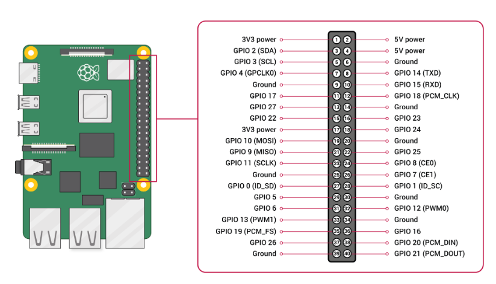 전원 및 접지 핀 <table>
<tr><td>기능</td><td>핀 번호</td><td>설명</td></tr>
<tr><td>3v3 power</td><td>1, 17</td><td>3.3v로 작동하는 센서나 부품에 전원을 공급</td></tr>
<tr><td>5v power</td><td>2, 4</td><td>5v로 작동하는 센서나 부품에 전원을 공급</td></tr>
<tr><td>ground</td><td>6,9,14,20,25,30,34,39</td><td>회로의 기준전압</td></tr>
</table> 기능 핀 <table>
<tr><td>기능</td><td>핀 번호</td><td>설명</td></tr>
<tr><td>GPIO</td><td>7,11,13,15,16,18,22,29, 31,32,33,36,37</td><td>범용 IO</td></tr>
<tr><td>I2C</td><td>3,5,27,28</td><td>다양한 외부 센서 및 장치와 2선 통신 가능</td></tr>
<tr><td>UART</td><td>8,10</td><td>범용 비동기 수신기/송신기</td></tr>
<tr><td>PCM</td><td>12,35,38,40</td><td>펄스 코드 변조</td></tr>
<tr><td>SPI</td><td>19,21,23,24,26</td><td>직렬 주변 장치 인터페이스</td></tr>
</table> 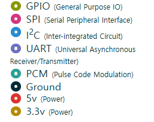 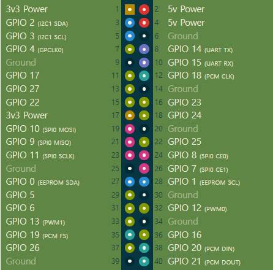</td></tr>
</table>

<table>
<tr><td>제품명</td><td colspan="2">Arduino Mega 2560 (R3)</td></tr>
<tr><td colspan="2">제품 사진</td><td>제품 사양</td></tr>
<tr><td colspan="2"></td><td><table>
<tr><td>마이크로컨트롤러</td><td>ATmega2560</td></tr>
<tr><td>동작 전압</td><td>5V</td></tr>
<tr><td>입력 전압 (권장값)</td><td>7–12V</td></tr>
<tr><td>입력 전압 (허용 한계)</td><td>6–20V</td></tr>
<tr><td>디지털 입출력 핀</td><td>54개 (이 중 15개는 PWM 가능)</td></tr>
<tr><td>아날로그 입력 핀</td><td>16개</td></tr>
<tr><td>핀당 허용 전류</td><td>20 mA</td></tr>
<tr><td>3.3V 핀 출력 전류</td><td>50 mA</td></tr>
<tr><td>플래시 메모리</td><td>256 KB (이 중 8 KB는 부트로더용)</td></tr>
<tr><td>SRAM</td><td>8 KB</td></tr>
<tr><td>EEPROM</td><td>4 KB</td></tr>
<tr><td>클록 속도</td><td>16 MHz</td></tr>
<tr><td>기본 내장 LED 핀</td><td>D13</td></tr>
<tr><td>길이</td><td>101.52 mm</td></tr>
<tr><td>너비</td><td>53.3 mm</td></tr>
<tr><td>무게</td><td>약 37 g</td></tr>
</table></td></tr>
<tr><td colspan="3">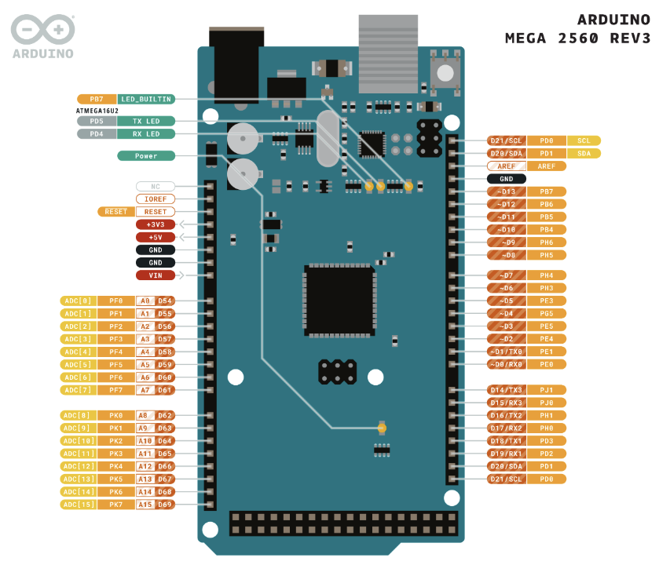 ❑ 아날로그 핀 <table>
<tr><td>핀 번호 (Pin)</td><td>기능 (Function)</td><td>타입 (Type)</td><td>설명 (Description, 한글 번역)</td></tr>
<tr><td>1</td><td>NC</td><td>NC</td><td>연결되지 않음 (Not Connected)</td></tr>
<tr><td>2</td><td>IOREF</td><td>IOREF</td><td>디지털 회로의 기준 전압 (5V 기준으로 연결됨)</td></tr>
<tr><td>3</td><td>Reset</td><td>Reset</td><td>보드를 재시작시키는 리셋 핀</td></tr>
<tr><td>4</td><td>+3V3</td><td>Power</td><td>3.3V 전원 출력 (저전압 센서용)</td></tr>
<tr><td>5</td><td>+5V</td><td>Power</td><td>5V 전원 출력 (센서 및 모듈 구동용)</td></tr>
<tr><td>6</td><td>GND</td><td>Power</td><td>접지 (Ground)</td></tr>
<tr><td>7</td><td>GND</td><td>Power</td><td>접지 (Ground, 보조 GND)</td></tr>
<tr><td>8</td><td>VIN</td><td>Power</td><td>외부 전원 입력 (7~12V 입력 시 내부 5V로 변환됨)</td></tr>
<tr><td>9</td><td>A0</td><td>Analog</td><td>아날로그 입력 0번 (GPIO로도 사용 가능)</td></tr>
<tr><td>10</td><td>A1</td><td>Analog</td><td>아날로그 입력 1번 / GPIO</td></tr>
<tr><td>11</td><td>A2</td><td>Analog</td><td>아날로그 입력 2번 / GPIO</td></tr>
<tr><td>12</td><td>A3</td><td>Analog</td><td>아날로그 입력 3번 / GPIO</td></tr>
<tr><td>13</td><td>A4</td><td>Analog</td><td>아날로그 입력 4번 / GPIO</td></tr>
<tr><td>14</td><td>A5</td><td>Analog</td><td>아날로그 입력 5번 / GPIO</td></tr>
<tr><td>15</td><td>A6</td><td>Analog</td><td>아날로그 입력 6번 / GPIO</td></tr>
<tr><td>16</td><td>A7</td><td>Analog</td><td>아날로그 입력 7번 / GPIO</td></tr>
<tr><td>17</td><td>A8</td><td>Analog</td><td>아날로그 입력 8번 / GPIO</td></tr>
<tr><td>18</td><td>A9</td><td>Analog</td><td>아날로그 입력 9번 / GPIO</td></tr>
<tr><td>19</td><td>A10</td><td>Analog</td><td>아날로그 입력 10번 / GPIO</td></tr>
<tr><td>20</td><td>A11</td><td>Analog</td><td>아날로그 입력 11번 / GPIO</td></tr>
<tr><td>21</td><td>A12</td><td>Analog</td><td>아날로그 입력 12번 / GPIO</td></tr>
<tr><td>22</td><td>A13</td><td>Analog</td><td>아날로그 입력 13번 / GPIO</td></tr>
<tr><td>23</td><td>A14</td><td>Analog</td><td>아날로그 입력 14번 / GPIO</td></tr>
<tr><td>24</td><td>A15</td><td>Analog</td><td>아날로그 입력 15번 / GPIO</td></tr>
</table> ❑ 디지털 핀 <table>
<tr><td>핀 번호 (Pin)</td><td>기능 (Function)</td><td>타입 (Type)</td><td>설명 (Description, 한글 번역)</td></tr>
<tr><td>1</td><td>D21 / SCL</td><td>Digital Input / I²C</td><td>디지털 입력 21번 / I²C 클록 라인 (SCL)</td></tr>
<tr><td>2</td><td>D20 / SDA</td><td>Digital Input / I²C</td><td>디지털 입력 20번 / I²C 데이터 라인 (SDA)</td></tr>
<tr><td>3</td><td>AREF</td><td>Digital</td><td>아날로그 입력의 기준 전압 설정용 핀</td></tr>
<tr><td>4</td><td>GND</td><td>Power</td><td>접지 (Ground)</td></tr>
<tr><td>5</td><td>D13</td><td>Digital / GPIO</td><td>디지털 입력 13번 / GPIO (보드 내장 LED 연결됨)</td></tr>
<tr><td>6</td><td>D12</td><td>Digital / GPIO</td><td>디지털 입력 12번 / GPIO</td></tr>
<tr><td>7</td><td>D11</td><td>Digital / GPIO</td><td>디지털 입력 11번 / GPIO</td></tr>
<tr><td>8</td><td>D10</td><td>Digital / GPIO</td><td>디지털 입력 10번 / GPIO</td></tr>
<tr><td>9</td><td>D9</td><td>Digital / GPIO</td><td>디지털 입력 9번 / GPIO</td></tr>
<tr><td>10</td><td>D8</td><td>Digital / GPIO</td><td>디지털 입력 8번 / GPIO</td></tr>
<tr><td>11</td><td>D7</td><td>Digital / GPIO</td><td>디지털 입력 7번 / GPIO</td></tr>
<tr><td>12</td><td>D6</td><td>Digital / GPIO</td><td>디지털 입력 6번 / GPIO</td></tr>
<tr><td>13</td><td>D5</td><td>Digital / GPIO</td><td>디지털 입력 5번 / GPIO</td></tr>
<tr><td>14</td><td>D4</td><td>Digital / GPIO</td><td>디지털 입력 4번 / GPIO</td></tr>
<tr><td>15</td><td>D3</td><td>Digital / GPIO</td><td>디지털 입력 3번 / GPIO</td></tr>
<tr><td>16</td><td>D2</td><td>Digital / GPIO</td><td>디지털 입력 2번 / GPIO</td></tr>
<tr><td>17</td><td>D1 / TX0</td><td>Digital / GPIO</td><td>디지털 입력 1번 / UART0 송신(TX)</td></tr>
<tr><td>18</td><td>D0 / RX0</td><td>Digital / GPIO</td><td>디지털 입력 0번 / UART0 수신(RX)</td></tr>
<tr><td>19</td><td>D14</td><td>Digital / GPIO</td><td>디지털 입력 14번 / GPIO</td></tr>
<tr><td>20</td><td>D15</td><td>Digital / GPIO</td><td>디지털 입력 15번 / GPIO</td></tr>
<tr><td>21</td><td>D16</td><td>Digital / GPIO</td><td>디지털 입력 16번 / GPIO</td></tr>
<tr><td>22</td><td>D17</td><td>Digital / GPIO</td><td>디지털 입력 17번 / GPIO</td></tr>
<tr><td>23</td><td>D18</td><td>Digital / GPIO</td><td>디지털 입력 18번 / GPIO</td></tr>
<tr><td>24</td><td>D19</td><td>Digital / GPIO</td><td>디지털 입력 19번 / GPIO</td></tr>
<tr><td>25</td><td>D20</td><td>Digital / GPIO</td><td>디지털 입력 20번 / I²C 데이터 라인 (SDA)</td></tr>
<tr><td>26</td><td>D21</td><td>Digital / GPIO</td><td>디지털 입력 21번 / I²C 클록 라인 (SCL)</td></tr>
</table> 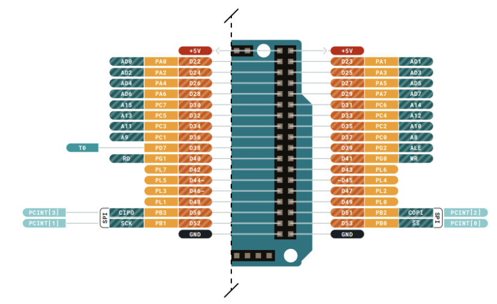 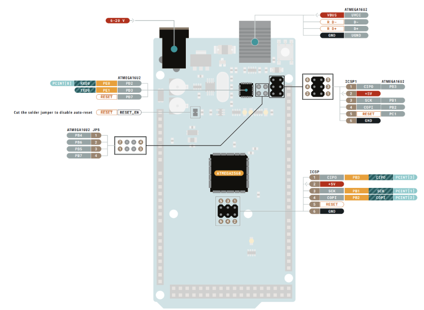 ❑ ICSP 포트 <table>
<tr><td>핀 번호</td><td>기능 (Function)</td><td>타입 (Type)</td><td>설명 (Description)</td></tr>
<tr><td>1</td><td>CIPO</td><td>Internal</td><td>주변장치 → 컨트롤러 데이터 입력 (Controller In Peripheral Out)</td></tr>
<tr><td>2</td><td>+5V</td><td>Internal</td><td>5V 전원 공급</td></tr>
<tr><td>3</td><td>SCK</td><td>Internal</td><td>직렬 클록 신호 (Serial Clock)</td></tr>
<tr><td>4</td><td>COPI</td><td>Internal</td><td>컨트롤러 → 주변장치 데이터 출력 (Controller Out Peripheral In)</td></tr>
<tr><td>5</td><td>RESET</td><td>Internal</td><td>리셋 신호 (보드 초기화용)</td></tr>
<tr><td>6</td><td>GND</td><td>Internal</td><td>접지 (Ground)</td></tr>
</table> ❑ 좌측핀 <table>
<tr><td>핀 번호</td><td>기능 (Function)</td><td>타입 (Type)</td><td>설명 (Description)</td></tr>
<tr><td>1</td><td>+5V</td><td>Power</td><td>5V 전원 공급</td></tr>
<tr><td>2</td><td>D22</td><td>Digital</td><td>디지털 입력 22번 / GPIO</td></tr>
<tr><td>3</td><td>D24</td><td>Digital</td><td>디지털 입력 24번 / GPIO</td></tr>
<tr><td>4</td><td>D26</td><td>Digital</td><td>디지털 입력 26번 / GPIO</td></tr>
<tr><td>5</td><td>D28</td><td>Digital</td><td>디지털 입력 28번 / GPIO</td></tr>
<tr><td>6</td><td>D30</td><td>Digital</td><td>디지털 입력 30번 / GPIO</td></tr>
<tr><td>7</td><td>D32</td><td>Digital</td><td>디지털 입력 32번 / GPIO</td></tr>
<tr><td>8</td><td>D34</td><td>Digital</td><td>디지털 입력 34번 / GPIO</td></tr>
<tr><td>9</td><td>D36</td><td>Digital</td><td>디지털 입력 36번 / GPIO</td></tr>
<tr><td>10</td><td>D38</td><td>Digital</td><td>디지털 입력 38번 / GPIO</td></tr>
<tr><td>11</td><td>D40</td><td>Digital</td><td>디지털 입력 40번 / GPIO</td></tr>
<tr><td>12</td><td>D42</td><td>Digital</td><td>디지털 입력 42번 / GPIO</td></tr>
<tr><td>13</td><td>D44</td><td>Digital</td><td>디지털 입력 44번 / GPIO</td></tr>
<tr><td>14</td><td>D46</td><td>Digital</td><td>디지털 입력 46번 / GPIO</td></tr>
<tr><td>15</td><td>D48</td><td>Digital</td><td>디지털 입력 48번 / GPIO</td></tr>
<tr><td>16</td><td>D50</td><td>Digital</td><td>디지털 입력 50번 / GPIO (SPI MISO)</td></tr>
<tr><td>17</td><td>D52</td><td>Digital</td><td>디지털 입력 52번 / GPIO (SPI SCK)</td></tr>
<tr><td>18</td><td>GND</td><td>Power</td><td>접지 (Ground)</td></tr>
</table> ❑ 우측핀 <table>
<tr><td>핀 번호</td><td>기능 (Function)</td><td>타입 (Type)</td><td>설명 (Description)</td></tr>
<tr><td>1</td><td>+5V</td><td>Power</td><td>5V 전원 공급</td></tr>
<tr><td>2</td><td>D23</td><td>Digital</td><td>디지털 입력 23번 / GPIO</td></tr>
<tr><td>3</td><td>D25</td><td>Digital</td><td>디지털 입력 25번 / GPIO</td></tr>
<tr><td>4</td><td>D27</td><td>Digital</td><td>디지털 입력 27번 / GPIO</td></tr>
<tr><td>5</td><td>D29</td><td>Digital</td><td>디지털 입력 29번 / GPIO</td></tr>
<tr><td>6</td><td>D31</td><td>Digital</td><td>디지털 입력 31번 / GPIO</td></tr>
<tr><td>7</td><td>D33</td><td>Digital</td><td>디지털 입력 33번 / GPIO</td></tr>
<tr><td>8</td><td>D35</td><td>Digital</td><td>디지털 입력 35번 / GPIO</td></tr>
<tr><td>9</td><td>D37</td><td>Digital</td><td>디지털 입력 37번 / GPIO</td></tr>
<tr><td>10</td><td>D39</td><td>Digital</td><td>디지털 입력 39번 / GPIO</td></tr>
<tr><td>11</td><td>D41</td><td>Digital</td><td>디지털 입력 41번 / GPIO</td></tr>
<tr><td>12</td><td>D43</td><td>Digital</td><td>디지털 입력 43번 / GPIO</td></tr>
<tr><td>13</td><td>D45</td><td>Digital</td><td>디지털 입력 45번 / GPIO</td></tr>
<tr><td>14</td><td>D47</td><td>Digital</td><td>디지털 입력 47번 / GPIO</td></tr>
<tr><td>15</td><td>D49</td><td>Digital</td><td>디지털 입력 49번 / GPIO (SPI MOSI)</td></tr>
<tr><td>16</td><td>D51</td><td>Digital</td><td>디지털 입력 51번 / GPIO (SPI SS)</td></tr>
<tr><td>17</td><td>D53</td><td>Digital</td><td>디지털 입력 53번 / GPIO (SPI CS)</td></tr>
<tr><td>18</td><td>GND</td><td>Power</td><td>접지 (Ground)</td></tr>
</table></td></tr>
</table>

---

## 본문에서 참조되지 않는 첨부 그림

> 원본 파일에는 들어 있지만 본문 어디에서도 표시되지 않는 그림입니다. 원래 위치가 없어 여기에 모았습니다 (내용은 추측하지 않음).

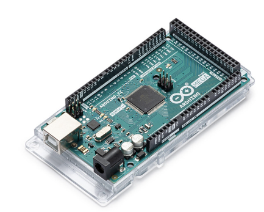

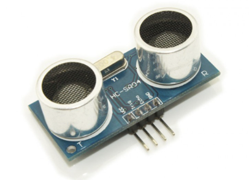

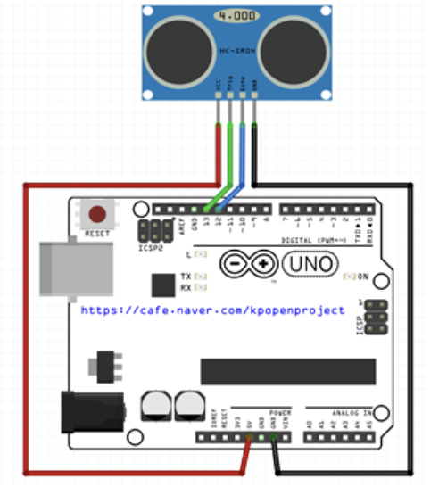
